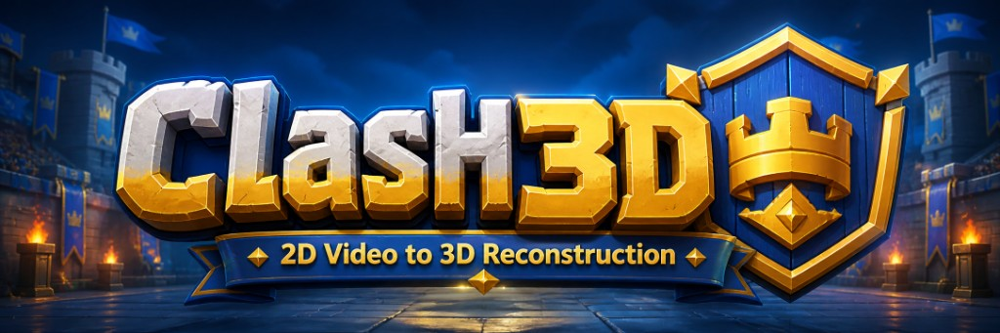
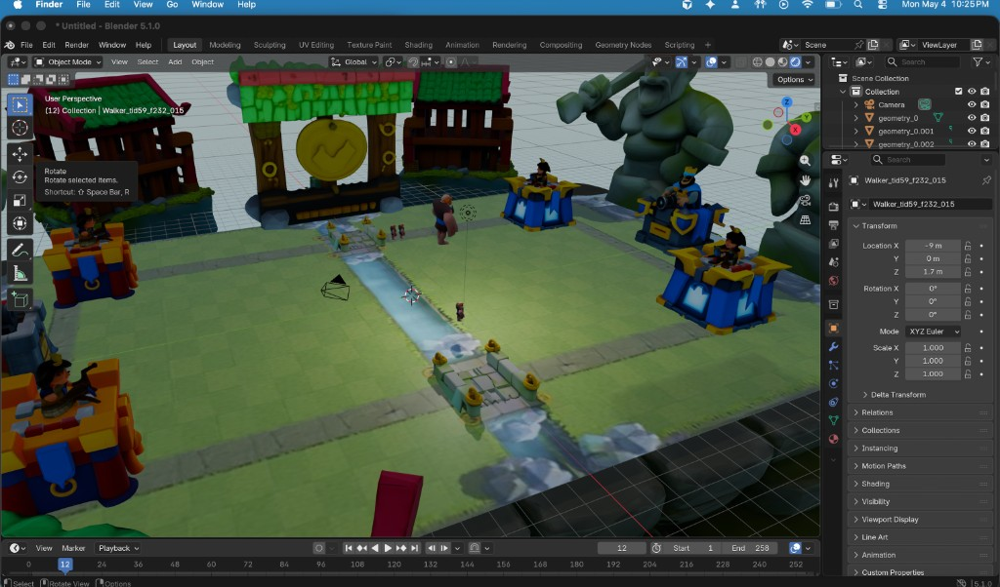

<p align="center">
  
</p>

# Clash3D

**Turn Clash Royale screen recordings into a 3D arena visualization**: computer vision tracks every troop; Blender brings the match to life on Hog Mountain arena.

## Why & general information

I’ve always loved **Clash Royale** and kept wondering whether you could **see the same match in 3D** instead of a flat top-down screen, not a clone of the game, but a way to **replay the action in a real 3D scene**. Along the way I wanted to get hands-on with **computer vision** and **machine learning**, so I built **Clash3D**: use a **YOLO** detector (with tracking) to follow units in the video, export **paths and class labels** to JSON, then **load that data in Blender** and drive **per-troop 3D flipbook** characters on the arena floor. In short: **record → detect/track → JSON → Blender**. 

## How it works (short version)

1. **Preprocess** gameplay footage (crop/resize to what the model expects).
2. Run **Ultralytics YOLO + ByteTrack** so each unit gets a **track id** and **class id** over time; save **2D positions** into a tracks JSON file.
3. **Blender** (`blender_hm.py`) reads that JSON, maps class ids to troop names, picks the right **folder of `.glb` walk poses** per troop, and **keyframes** those meshes along the ground plane so they follow the tracked path.

That’s the whole pipeline: vision finds *who* and *where* over time; Blender handles *look* and *motion* in 3D.

## What I learned

- How **detection + tracking** differ: boxes per frame vs. consistent IDs across frames.
- **Label space matters** — your YOLO `class_id` list has to line up with a label file and with which **3D asset folder** you assign per troop.
- **Calibration** (screen space → ground plane) is finicky: the same math has to match your **preprocessed resolution** or units slide or float wrong.
- **Blender as a backend** is viable: you can treat it like an offline “renderer + animator” driven entirely by Python and JSON.
- **Scope creep is real** — towers, destruction, smoother motion are all doable next steps once the data actually encodes them.

<p align="center">
  
  <br />
  <em>Blender viewport: arena build plus a tracked troop flipbook (<code>Walker_tid…</code>) driven from inference.</em>
</p>

---

## What’s in the pipeline

1. **Preprocess** — crop/resize frames to 576×896 for the detector.
2. **Track** — Ultralytics YOLO runs on the processed video; centroids are accumulated per `track_id` and `class_id`.
3. **Blender** — [`blender_hm.py`](blender_hm.py) loads tracks, maps `class_id` → troop name via [`config/labels_yaml.json`](config/labels_yaml.json), resolves GLB folders from [`config/troop_flipbooks.json`](config/troop_flipbooks.json) and/or `3d_models_folder/*_run/models/`, and keyframes flipbook meshes along the path.

## Layout

| Path | Purpose |
|------|---------|
| `inference_pipeline/` | `inference_final.py`, `run_inference_simple.py` |
| `config/labels_yaml.json` | YOLO class id → string name |
| `config/troop_flipbooks.json` | Optional class id / name → flipbook folder |
| `3d_models_folder/<troop>_run/models/` | Ordered `.glb` walk poses per troop |
| `assets/giant_3d_model/` | Default giant flipbook if no per-class folder matches |
| `outputs/preprocessed/`, `outputs/tracks/` | Default preprocess MP4 and `*_tracks.json` |

Large arena props and floor images can live under `cr-assets-png/` **(often not committed — too large)**. If you clone fresh, copy your Hog Mountain assets locally or change `BACKGROUND_IMAGE` / GLB paths inside [`blender_hm.py`](blender_hm.py) to match your machine.

## Setup

```bash
cd Clash3D
uv sync   # or: pip install -e .
```

Place a finetuned weights file (e.g. `clash_yolo_4_13.pt`) at the repo root or pass `--model_path`.

## Run inference

From repo root:

```bash
python3 inference_pipeline/run_inference_simple.py vids/your_clip.mp4
```

Writes `outputs/preprocessed/<stem>_processed.mp4` and `outputs/tracks/<stem>_tracks.json`.

## Run Blender

```bash
blender --python blender_hm.py
```

Optional environment variables:

- `CR_TRACKS_JSON` — path to a specific `*_tracks.json` (default searches `outputs/tracks/`).
- `CR_BLENDER_TIME_BASE=video` (default) or `track` — timeline alignment vs processed footage.

## Per-troop art

Each troop needs a folder of **multiple** `.glb` files (walk cycle), not a single mesh. Convention: `3d_models_folder/<name-from-labels>_run/models/` (exception: `ice-spirit` → `ice_spirits_run`). Override paths in `config/troop_flipbooks.json` if the folder name doesn’t match.

## Disclaimer

This project is an independent fan / research pipeline and is not affiliated with Supercell or Clash Royale. Game assets are used for personal/educational purposes; respect Supercell’s terms and IP.
